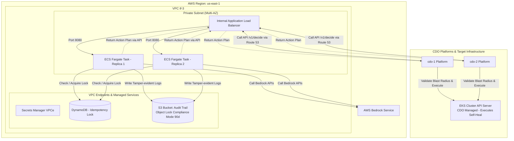

# Deployment Contract - Generic Multi-Tenant Self-Heal Platform

<!-- Owner: Architecture & Platform Infrastructure Team
     Signed by: Principal AI Architect + Lead Platform Engineers
     Date signed: 2026-06-25
     🔒 FREEZE - no change without formal change request -->

## 1. Mục đích

Tài liệu này xác định **Hợp đồng Triển khai (Deployment Specification)**. Hợp đồng quy định cách thức thiết lập hạ tầng ảo hóa, cơ chế định tuyến, quản lý định danh/bí mật (Secrets), chính sách an toàn Kubernetes RBAC, cơ chế khóa trùng lặp (Idempotency Lock), và các tiêu chuẩn kiểm tra sức khỏe của AI Engine khi tích hợp vào các nền tảng hạ tầng (CDO Platforms).

---

## 1.5. Target Topology: Namespace & Deployment Mapping Conventions

Mục này định nghĩa cấu trúc thiết lập topology hệ thống đích, thiết lập quy chuẩn ánh xạ giữa các dịch vụ nghiệp vụ và các tài nguyên hạ tầng thực tế trên cụm Kubernetes để phục vụ công tác điều khiển tự chữa lành an toàn.

### A. Quy tắc cấu trúc định danh
1. **Target Namespace**: Môi trường chạy các dịch vụ được phân lập theo namespace của Kubernetes. Tên của namespace vận hành dịch vụ (`Target Namespace`) sẽ được cấu hình động dựa trên cấu hình môi trường của từng dự án cụ thể.
2. **Deployment Resource**: Mọi dịch vụ nghiệp vụ (`service`) bắt buộc phải tương ứng với một đối tượng Kubernetes Deployment quản trị. Định dạng định danh tài nguyên chuẩn là `deployment/<deployment_name>`.

### B. Quy chuẩn cấu trúc dữ liệu yêu cầu
Trong mọi giao dịch API liên dịch vụ (như gửi telemetry, lập kế hoạch `/v1/decide`, và báo cáo `/v1/verify`), các trường `namespace` và `deployment` là tùy chọn (optional) và có thể được truyền tải dưới dạng chuỗi ký tự (`string`) theo quy chuẩn sau:
* `namespace`: Tên của K8s namespace đang chứa tài nguyên đích (Tùy chọn, ví dụ: `[operational_namespace_name]`).
* `deployment`: Tên của đối tượng K8s Deployment quản trị trực tiếp dịch vụ bị lỗi (Tùy chọn, ví dụ: `[k8s_deployment_resource_name]`).

### C. Bảng cấu trúc ánh xạ đăng ký dịch vụ (Template Registry)
Dưới đây là cấu trúc bảng mẫu dùng để đăng ký và đối chiếu tài nguyên khi dự án cụ thể được triển khai thực tế:

| Dịch vụ nghiệp vụ (`service`) | K8s Namespace (`namespace`) | Đối tượng Deployment đích (`deployment`) |
|---|---|---|
| `<service_name_1>` | `<target_namespace>` | `deployment/<deployment_name_1>` |
| `<service_name_2>` | `<target_namespace>` | `deployment/<deployment_name_2>` |
| ... | ... | ... |

*Lưu ý an toàn*: CDO Platform có trách nhiệm kiểm tra và xác thực (validate) tính hợp lệ của cặp giá trị `[namespace, deployment]` trước khi thực thi bất kỳ hành động nào lên hạ tầng, đảm bảo hành động nằm hoàn toàn trong phạm vi blast radius cho phép của tenant tương ứng.

---

## 2. Infrastructure Hosting & Offline Testing Strategy

AI Engine được triển khai dưới dạng **shared backend service** chạy trên ECS Fargate tasks độc lập. Nhóm AI chịu trách nhiệm quản lý, build image, task definition, runtime và scale, trong khi các CDO platform tích hợp bằng cách gọi vào endpoint nội bộ được cung cấp dưới đây.

### A. Compute Configuration

Bảng dưới đây mô tả các thông số triển khai tối thiểu mà AI team phải cung cấp và duy trì cho AI Engine:

| Aspect | Configuration |
|---|---|
| **Target Compute** | ECS Fargate |
| **Cluster name** | `tf-3-aiops-cluster` |
| **Service name** | `ai-engine` |
| **Task definition family** | `tf-3-ai-engine` |
| **Container name** | `ai-engine` |
| **Container port** | `8080` |
| **Image source** | ECR repo URI + immutable image tag |
| **CPU per task** | 1024 CPU units (1.0 vCPU) |
| **Memory per task** | 2048 MB (2.0 GB) |

### B. Per-Tenant Capacity & Scaling Guardrails

Hệ thống hỗ trợ scaling tự động để bảo đảm hiệu năng phục vụ multi-tenant:

| Aspect | Value |
|---|---|
| **Replicas** | Min: 2 tasks, Max: 10 tasks |
| **Autoscale trigger 1** | Target CPU >= 70% |
| **Autoscale trigger 2** | Target request count 100 per task |
| **Scale-up cooldown** | 60 giây |
| **Scale-down cooldown** | 300 giây |

### C. CDO Platform Integration & Routing

AI Engine chạy một instance duy nhất (shared backend) cho cả hai CDO platform:

| CDO platform | Tenant ID | Endpoint URL | Auth |
|---|---|---|---|
| **cdo-1** | `d3b07384-d113-495f-9f58-20d18d357d75` | `https://ai-engine.tf-3.internal/` | IAM SigV4 / AWS STS AssumeRole |
| **cdo-2** | `6c8b4b2b-4d45-4209-a1b4-4b532d56a31c` | `https://ai-engine.tf-3.internal/` | IAM SigV4 / AWS STS AssumeRole |
| **Simulation (Scenario Type 1)** | `d3b07384-d113-495f-9f58-20d18d357d75` | (Internal simulation routing) | IAM SigV4 / Local |
| **Simulation (Scenario Type 2)** | `6c8b4b2b-4d45-4209-a1b4-4b532d56a31c` | (Internal simulation routing) | IAM SigV4 / Local |

### D. Chiến lược chạy thử nghiệm mô phỏng (Offline Simulation Mode)
* Vì dữ liệu thử nghiệm ngoại tuyến được tổ chức dưới dạng tệp dữ liệu tĩnh lịch sử, các hành động thay đổi trạng thái thật (`RESTART_DEPLOYMENT`, `SCALE_UP_PODS`,...) sẽ được **chạy ở chế độ giả lập (Mock Mode)** trong môi trường sandbox của CDO.
* CDO Platform sẽ ghi nhận lệnh gọi từ AI Engine, ghi log kiểm toán tương ứng, và mô phỏng phản hồi thành công. Dữ liệu telemetry phản hồi tiếp theo sẽ được trích xuất từ dữ liệu tĩnh lịch sử sau mốc thời gian lỗi để gửi xác thực.

---

## 3. ECS IAM Roles & Secrets Management

Để bảo đảm an toàn hạ tầng và tuân thủ các nguyên tắc đặc quyền tối thiểu (Least Privilege), phân quyền IAM được chia tách rõ ràng giữa giai đoạn khởi tạo (Execution) và giai đoạn chạy (Task).

### A. Phân tách IAM Roles
1. **ECS Task Execution Role**: Được sử dụng bởi ECS Agent để pull image từ ECR, đẩy logs lên CloudWatch Logs và lấy các secret từ Secrets Manager khi khởi tạo container.
2. **ECS Task Role**: Được sử dụng trực tiếp bởi ứng dụng AI Engine tại runtime để gọi các dịch vụ AWS Bedrock, DynamoDB, S3 và AWS STS AssumeRole. AI Engine **không** có quyền truy cập trực tiếp vào Kubernetes (EKS) API, đảm bảo phân ranh giới rõ ràng: AI Engine là bộ não ra quyết định (Brain), còn CDO Platform là bàn tay thực thi (Hands) hành động trên Kubernetes.

### B. AWS Secrets Manager Path Conventions
Tất cả các secret liên quan đến AI Engine phải được lưu trữ theo quy chuẩn đường dẫn sau:
* Base path: `tf-3/ai-engine/*`
* API Key cho Bedrock: `tf-3/ai-engine/bedrock`

*Lưu ý*: Nghiêm cấm hardcode thông tin xác thực (Access Key/Secret Key) trong code hoặc Task Definition. Mọi credential rotate tự động thông qua Secrets Manager rotation policy.

### C. Task Execution Role IAM Policy (Ví dụ tham chiếu)
```json
{
  "Version": "2012-10-17",
  "Statement": [
    {
      "Effect": "Allow",
      "Action": [
        "ecr:GetAuthorizationToken",
        "ecr:BatchCheckLayerAvailability",
        "ecr:GetDownloadUrlForLayer",
        "ecr:BatchGetImage"
      ],
      "Resource": "*"
    },
    {
      "Effect": "Allow",
      "Action": [
        "logs:CreateLogStream",
        "logs:PutLogEvents"
      ],
      "Resource": "arn:aws:logs:us-east-1:*:log-group:/aws/ecs/tf-3-ai-engine:*"
    },
    {
      "Effect": "Allow",
      "Action": [
        "secretsmanager:GetSecretValue"
      ],
      "Resource": "arn:aws:secretsmanager:us-east-1:*:secret:tf-3/ai-engine/*"
    }
  ]
}
```

### D. Task Role IAM Policy (Runtime - Ví dụ tham chiếu)
```json
{
  "Version": "2012-10-17",
  "Statement": [
    {
      "Sid": "DynamoDBIdempotencyLock",
      "Effect": "Allow",
      "Action": [
        "dynamodb:GetItem",
        "dynamodb:PutItem",
        "dynamodb:UpdateItem"
      ],
      "Resource": "arn:aws:dynamodb:us-east-1:*:table/tf-3-aiops-idempotency-lock"
    },
    {
      "Sid": "S3AuditTrailWrite",
      "Effect": "Allow",
      "Action": [
        "s3:PutObject",
        "s3:GetObject"
      ],
      "Resource": "arn:aws:s3:::tf-3-aiops-audit-trail/*"
    },
    {
      "Sid": "BedrockInvokeModel",
      "Effect": "Allow",
      "Action": [
        "bedrock:InvokeModel",
        "bedrock:InvokeModelWithResponseStream"
      ],
      "Resource": "arn:aws:bedrock:us-east-1::foundation-model/*"
    },
    {
      "Sid": "STSAssumeTenantRole",
      "Effect": "Allow",
      "Action": [
        "sts:AssumeRole",
        "sts:TagSession"
      ],
      "Resource": "arn:aws:iam::*:role/tf-3-tenant-*-role"
    }
  ]
}
```

*Điều khoản cấm (Forbidden Actions)*: Task Role tuyệt đối không được cấp quyền `iam:*`, `ec2:*` hoặc các hành động sửa đổi hạ tầng mạng. Đặc biệt, cấm cấp quyền Kubernetes API (`eks:*`) hoặc lưu trữ `kubeconfig` trực tiếp trong AI Engine, đảm bảo AI Engine không thể tự ý thay đổi trạng thái cụm K8s mà không thông qua sự xác thực của CDO Platform.

### E. Phân lập dữ liệu đa thuê bao qua AWS STS AssumeRole & Session Tags
Để đảm bảo tính cô lập và bảo mật dữ liệu tuyệt đối giữa hai tenant `cdo-1` và `cdo-2`, AI Engine áp dụng mô hình phân quyền dựa trên thuộc tính (ABAC - Attribute-Based Access Control) thông qua AWS STS:
1. **AssumeRole theo Tenant**: Khi nhận được request, AI Engine dựa trên `tenant_id` để thực hiện cuộc gọi `AssumeRole` đến IAM Role dành riêng cho tenant đó (`arn:aws:iam::*:role/tf-3-tenant-[tenant_id]-role`).
2. **Session Tags**: Khi giả lập role, AI Engine bắt buộc phải đính kèm cặp thẻ phiên làm việc (Session Tags) `"TenantID": "[tenant_id]"`.
3. **Kiểm soát Truy cập ABAC**: Các tài nguyên đám mây thuộc quyền sở hữu của tenant (ví dụ: các S3 Bucket chứa dữ liệu huấn luyện riêng, DynamoDB tables) sẽ cấu hình Resource-based Policy chỉ cho phép truy cập nếu `aws:PrincipalTag/TenantID` của thực thể gọi trùng khớp với nhãn sở hữu tài nguyên.
4. **Audit Trail**: Mọi hành động AssumeRole và các thao tác tài nguyên sau đó đều được ghi nhận chi tiết trên AWS CloudTrail và được đồng bộ về hệ thống giám sát của CDO phục vụ tuân thủ SOC2.

---

## 4. Idempotency Lock & Audit Logging (SOC2 Compliance)

### A. Idempotency Lock

#### 1. Tại sao cần Idempotency Lock?
Trong môi trường phân tán hoặc khi xảy ra sự cố mạng, một hệ thống giám sát (CDO) có thể gửi yêu cầu gọi API `/v1/decide` hoặc thực thi hành động nhiều lần do cơ chế tự động thử lại (Retry).
* Nếu không có Idempotency Lock, hạ tầng có thể thực hiện một hành động sửa lỗi **2 lần liên tiếp** (ví dụ: Khởi động lại deployment 2 lần liên tục, hoặc tăng số lượng pod gấp đôi 2 lần), gây mất ổn định nghiêm trọng hơn và lãng phí tài nguyên hạ tầng.

#### 2. Nguyên lý hoạt động
1. Mỗi quyết định hành động tự chữa lành được sinh ra tại `/v1/decide` bắt buộc phải kèm theo một `Idempotency-Key` (UUID v4 duy nhất).
2. Khi bắt đầu thực thi hành động, CDO Platform sẽ kiểm tra khóa này trong cơ sở dữ liệu khóa (Lock database).
3. Nếu khóa **chưa tồn tại**: Hệ thống sẽ ghi nhận khóa và tiến hành thực thi hành động.
4. Nếu khóa **đã tồn tại** (đang chạy hoặc đã hoàn thành gần đây): Hệ thống sẽ từ chối và trả về mã lỗi **`409 Conflict`** cho các yêu cầu trùng lặp, bảo đảm hành động chỉ được thực hiện duy nhất 1 lần.

- Mọi action plan được quyết định tại `/v1/decide` phải có `Idempotency-Key`.
- Nhóm CDO platform sử dụng **DynamoDB với Conditional Writes** (hoặc **Redis lock** với TTL = 5 phút) để khóa trùng lặp lệnh. Nếu một action đang chạy, mọi request trùng `Idempotency-Key` sẽ bị từ chối với mã lỗi `409 Conflict`.

### B. Tamper-Evident Audit Logging
- Mọi chu kỳ xử lý (Detect -> Decide -> Execute -> Verify) bắt buộc phải được ghi nhật ký hoạt động đầy đủ.
- **Hạ tầng lưu trữ**: Sử dụng **Amazon S3** được cấu hình chế độ **Object Lock** (WORM - Write Once, Read Many) ở chế độ **Compliance mode** với thời gian giữ tối thiểu **90 ngày**.
- CDO platform chịu trách nhiệm cung cấp giao diện truy vấn nhật ký kiểm toán (thông qua Amazon Athena hoặc UI quản trị).

### C. Bedrock Cost Cap & Budget Alerting (Quản trị chi phí LLM)

Để ngăn ngừa nguy cơ phát sinh chi phí đột biến ngoài ý muốn (runaway cost) do mô hình LLM (AWS Bedrock) gọi liên tục trong các chu kỳ tự chữa lành (ví dụ: vòng lặp vô hạn khi xảy ra lỗi nghiêm trọng liên tục), hệ thống thiết lập cơ chế quản trị chi phí nghiêm ngặt:

1. **Hạn mức Chi phí Hàng ngày (Cost Cap)**: Thiết lập hạn mức chi phí tối đa cho dịch vụ Bedrock là **$50/ngày** trên mỗi Tenant.
2. **Cơ chế Cảnh báo Tự động (Alerting)**:
   * **Ngưỡng 1 (Cảnh báo Sớm - 80%):** Khi chi phí Bedrock tích lũy trong ngày đạt **$40**, hệ thống tự động gửi cảnh báo khẩn cấp (Slack/Teams/CloudWatch Alarm) đến nhóm vận hành của cả AI Team và CDO Team.
   * **Ngưỡng 2 (Ngắt kết nối - 100%):** Khi chi phí đạt **$50**, hệ thống kích hoạt cơ chế ngắt tự động (Circuit Breaker).
3. **Cơ chế Dự phòng Không LLM (Fallback Rule-Based Mode)**:
   * Sau khi vượt hạn mức $50/ngày, cuộc gọi tiếp theo đến `/v1/decide` sẽ tự động chuyển sang chế độ dự phòng rule-based truyền thống (không gọi LLM Bedrock).
   * Phản hồi từ `/v1/decide` lúc này sẽ chứa thuộc tính cảnh báo `"cost_cap_exceeded": true` kèm theo cảnh báo trong trường giải thích `reasoning`, giúp hệ thống tiếp tục vận hành ở mức cơ bản nhưng không phát sinh thêm chi phí.
   * Hạn mức chi phí sẽ được tự động thiết lập lại (reset) vào lúc `00:00:00 UTC` hàng ngày.

---

## 5. Networking & Security Groups

AI Engine được triển khai hoàn toàn trong mạng nội bộ bảo mật, không tiếp xúc trực tiếp với Internet công cộng.

### A. Network Architecture
- **Subnet type**: Private Subnet (Multi-AZ).
- **Public IP**: Vô hiệu hóa hoàn toàn (`assign_public_ip = false`).
- **Load Balancer**: Sử dụng Internal Application Load Balancer (Internal ALB) định tuyến trên port 8080.
- **DNS**: Truy cập nội bộ qua Route 53 Private Hosted Zone với tên miền: `https://ai-engine.tf-3.internal/`.

### B. Security Group Rules (`tf-3-ai-engine-sg`)

#### Ingress (Inbound) Rules

| Source | Protocol | Port Range | Description |
|---|---|---|---|
| CDO-1 Platform Security Group | TCP | `8080` | Cho phép CDO-1 Platform gửi request API (`v1/detect`, `v1/decide`, `v1/verify`) |
| CDO-2 Platform Security Group | TCP | `8080` | Cho phép CDO-2 Platform gửi request API (`v1/detect`, `v1/decide`, `v1/verify`) |
| Mọi nguồn khác (Anywhere) | All | All | Chặn hoàn toàn (Deny by default) |

#### Egress (Outbound) Rules

| Destination | Protocol | Port Range | Description |
|---|---|---|---|
| AWS Secrets Manager VPC Endpoint | TCP | `443` | Kết nối lấy secrets và credentials cấu hình |
| AWS Bedrock Endpoint | TCP | `443` | Gọi APIs của AWS Bedrock phục vụ phân tích log/context |
| Amazon DynamoDB VPC Endpoint | TCP | `443` | Kiểm tra và cập nhật khóa chống trùng lặp (Idempotency Lock) |
| Amazon S3 VPC Endpoint | TCP | `443` | Ghi nhật ký kiểm toán (Audit Trail) phục vụ tuân thủ SOC2 |

*Lưu ý An toàn:* Do mô hình kiến trúc tách biệt trách nhiệm (CDO thực thi), Security Group của AI Engine tuyệt đối không mở cổng egress kết nối đến API Server của cụm Kubernetes (EKS API Server), giảm thiểu tối đa rủi ro bảo mật từ các cuộc tấn công leo thang đặc quyền.

### C. Deployment Topology Diagram



---

## 6. Rollback & Canary Rollout

### A. Rollout Strategy (Canary)
- **Bước 1**: Điều hướng 10% lưu lượng sang phiên bản AI Engine mới. Giữ trong 5 phút để theo dõi.
- **Bước 2**: Tăng lên 50% lưu lượng. Giữ trong 5 phút để theo dõi.
- **Bước 3**: Hoàn tất 100% lưu lượng nếu không phát hiện bất thường.

### B. Tiêu chuẩn dừng khẩn cấp (Abort Criteria)
Hệ thống giám sát Canary của CDO sẽ tự động dừng rollout và kích hoạt rollback ngay lập tức nếu phát hiện bất kỳ tiêu chí nào sau đây:
- Tỷ lệ lỗi API của AI Engine (`5xx` error rate) vượt quá `1.0%`.
- Độ trễ phản hồi p99 của AI Engine vượt quá `800 ms`.
- Kiểm tra sức khỏe (Health Check) thất bại liên tiếp quá ngưỡng quy định.
- **Tốc độ tiêu thụ ngân sách lỗi nhanh (Error Budget Burn Rate Fast Alert):** Tỷ lệ tiêu hao ngân sách lỗi của các dịch vụ nghiệp vụ (do CDO giám sát) vượt quá ngưỡng cảnh báo nhanh (Fast Burn Rate > 14.4 trong cửa sổ 1 giờ, hoặc tiêu thụ quá 2% ngân sách lỗi trong vòng 1 giờ), biểu thị sự cố nghiêm trọng ảnh hưởng trực tiếp đến người dùng cuối.

### C. Cơ chế Rollback
- **Phương thức chính**: AWS CodeDeploy tự động rollback (Blue/Green) điều hướng lưu lượng traffic về phiên bản (Task Set) ổn định trước đó khi có cảnh báo từ CloudWatch Alarms hoặc khi có tín hiệu hủy (Abort) từ CDO Platform.
- **Phương thức dự phòng**: ECS Deployment Circuit Breaker tự động rollback dịch vụ sang Task Definition version ổn định gần nhất nếu các task mới gặp lỗi khởi động (OOM, Crash) hoặc không vượt qua kiểm tra sức khỏe.
- **Mục tiêu RTO (Recovery Time Objective)**: `< 60 giây` từ thời điểm kích hoạt.

---

## 7. Health Check & Readiness Endpoints

AI Engine phải cung cấp các HTTP endpoints sau trên container port `8080` để phục vụ công tác giám sát trạng thái và định tuyến của ALB:

### A. Health Check Endpoint (`GET /health`)
* **Mục đích**: Kiểm tra trạng thái sống (Liveness) của container. Chỉ chạy các kiểm tra nhanh nội bộ.
* **Mô tả trường dữ liệu phản hồi (Fields Description)**:

| Trường (Field) | Kiểu dữ liệu (Type) | Bắt buộc (Required) | Mô tả (Description) |
|---|---|---|---|
| `status` | string (Enum) | ✓ | Trạng thái sống của container, cố định là `"healthy"` |
| `timestamp` | string (RFC3339) | ✓ | Mốc thời gian kiểm tra trạng thái theo chuẩn UTC |

* **Lược đồ Schema Phản hồi**:
```json
{
  "$schema": "http://json-schema.org/draft-07/schema#",
  "title": "HealthCheckResponse",
  "type": "object",
  "properties": {
    "status": {
      "type": "string",
      "enum": ["healthy"]
    },
    "timestamp": {
      "type": "string",
      "format": "date-time"
    }
  },
  "required": ["status", "timestamp"],
  "additionalProperties": false
}
```
* **Payload mẫu**:
  ```json
  {
    "status": "healthy",
    "timestamp": "2026-06-25T10:00:00Z"
  }
  ```

### B. Readiness Check Endpoint (`GET /ready`)
* **Mục đích**: Xác nhận AI Engine đã sẵn sàng tiếp nhận traffic thông qua kiểm tra các kết nối hạ nguồn.
* **Mô tả trường dữ liệu phản hồi (Fields Description)**:

| Trường (Field) | Kiểu dữ liệu (Type) | Bắt buộc (Required) | Mô tả (Description) |
|---|---|---|---|
| `status` | string (Enum) | ✓ | Trạng thái sẵn sàng tiếp nhận traffic (`"ready"` hoặc `"unready"`) |
| `dependencies` | object | ✓ | Đối tượng chứa thông tin trạng thái chi tiết của các dịch vụ liên kết |
| `dependencies.bedrock` | string | ✓ | Trạng thái kết nối tới AWS Bedrock (ví dụ: `"connected"`) |
| `dependencies.dynamodb_lock` | string | ✓ | Trạng thái kết nối tới DynamoDB Idempotency Lock (ví dụ: `"connected"`) |
| `dependencies.s3_audit_trail` | string | ✓ | Trạng thái kết nối tới S3 Audit Trail (ví dụ: `"connected"`) |

* **Lược đồ Schema Phản hồi**:
```json
{
  "$schema": "http://json-schema.org/draft-07/schema#",
  "title": "ReadinessCheckResponse",
  "type": "object",
  "properties": {
    "status": {
      "type": "string",
      "enum": ["ready", "unready"]
    },
    "dependencies": {
      "type": "object",
      "properties": {
        "bedrock": { "type": "string" },
        "dynamodb_lock": { "type": "string" },
        "s3_audit_trail": { "type": "string" }
      },
      "required": ["bedrock", "dynamodb_lock", "s3_audit_trail"]
    }
  },
  "required": ["status", "dependencies"],
  "additionalProperties": false
}
```
* **Payload mẫu**:
  ```json
  {
    "status": "ready",
    "dependencies": {
      "bedrock": "connected",
      "dynamodb_lock": "connected",
      "s3_audit_trail": "connected"
    }
  }
  ```

### C. Metrics Endpoint (`GET /metrics`)
- **Mục đích**: Cung cấp các thông số giám sát định dạng Prometheus để CDO Collector thu thập.
- **Exposed metrics**: Lượt requests, độ trễ API, lỗi hệ thống, CPU/Memory usage.

### D. ALB Health Check Parameters
* **Port**: 8080
* **Interval**: 30 giây
* **Healthy threshold**: 2 lần kiểm tra liên tiếp thành công (HTTP 200)
* **Unhealthy threshold**: 3 lần kiểm tra liên tiếp thất bại (non-200)

---

## 8. Failure Modes & Response & Observability

### A. Observability
- **OTel Endpoint**: Cấu hình URL của OTel Collector tương ứng với từng CDO platform thông qua environment variables.
- **Logs**: Đẩy logs tập trung về Amazon CloudWatch Logs (retention policy 14 ngày).
- **Metrics**: Cung cấp Prometheus endpoints phục vụ thu thập chủ động (pull-based).
- **Traces**: Định dạng OpenTelemetry đẩy về Jaeger hoặc AWS X-Ray.

### B. Failure Modes & Response Action Table

| Failure Mode | Detection | Response |
|---|---|---|
| **Task crash / Out of Memory** | ECS Container Health Check | ECS Agent tự động khởi động lại Task |
| **Bedrock API Throttling (429)** | Lỗi trả về từ SDK Bedrock | Áp dụng Exponential Backoff + chuyển sang Fallback Rule-Based (chế độ dự phòng không LLM) |
| **Rò rỉ bộ nhớ (Memory Leak)** | Sử dụng bộ nhớ task vượt > 90% | Kích hoạt cơ chế Rolling Restart các tasks một cách tuần tự |
| **Mất kết nối DynamoDB/S3** | Alert từ `/ready` endpoint | Ngắt traffic ALB sang task lỗi, kích hoạt luồng fallback của CDO Platform sang static runbook |


