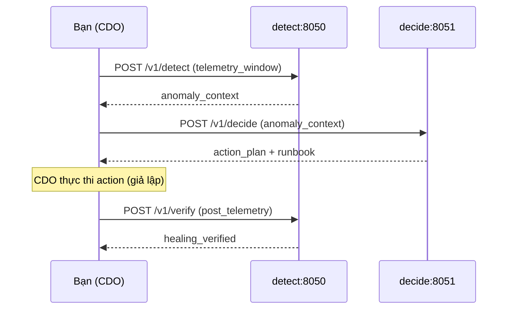

# Hướng dẫn test End-to-End — Detect → Decide → Verify

Tài liệu này hướng dẫn **tự test** luồng AIOps AI Engine trên máy local (Windows / PowerShell).

---

## 1. Kiến trúc luồng test

```text
Bạn (đóng vai CDO)
    │
    ├─► detect :8050  POST /v1/detect   → anomaly_context
    │
    ├─► decide :8051  POST /v1/decide   → action_plan (runbook)
    │
    └─► detect :8050  POST /v1/verify   → xác nhận healing
```

| Service | Port | Endpoint | Ghi chú |
|---------|------|----------|---------|
| **detect** | `8050` | `/v1/detect`, `/v1/verify` | Phát hiện bất thường + xác minh sau heal |
| **decide** | `8051` | `/v1/decide` | Khớp runbook & sinh action plan |

> **Lưu ý:** `decide` là service **riêng** trên port **8051**. Không gọi `/v1/decide` trên detect (8050) khi test kiến trúc mới.

### Dataset dùng chung

Dữ liệu nằm tại `ai-engine/dataset/` (dùng cho cả detect và decide):

```text
ai-engine/
  dataset/              ← RE2-OB/ (hoặc các thư mục lỗi), ground_truth.json, runbooks.json
  detect/
  decide/
```

---

## 2. Chuẩn bị

### 2.1. Mở 3 terminal

| Terminal | Mục đích |
|----------|----------|
| **T1** | Chạy detect server (8050) |
| **T2** | Chạy decide server (8051) |
| **T3** | Gửi request / chạy script test |

### 2.2. Kích hoạt môi trường Python

```powershell
cd "c:\Users\husky\Downloads\Project Folder\Capstone-Phase-2-Code\tf-3\ai\ai-engine"
.\.venv\Scripts\Activate.ps1
pip install -r detect\requirements.txt   # nếu lỗi "file not found", xem detect/requirements.txt
pip install -r decide\requirements.txt
```

### 2.3. Kiểm tra dataset

```powershell
dir dataset
```

Cần có ít nhất:
- `ground_truth.json`
- `runbooks.json`
- thư mục dữ liệu (ví dụ các thư mục như `checkoutservice_cpu_1\`)

Nếu thiếu `runbooks.json`:

```powershell
cd decide
python scripts\setup_dataset.py
```

---

## 3. Khởi động server

### T1 — Detect (port 8050)

```powershell
cd "...\ai-engine\detect"
python -m uvicorn src.server:app --host 127.0.0.1 --port 8050 --reload
```

Giữ terminal **mở**.

### T2 — Decide (port 8051)

```powershell
cd "...\ai-engine\decide"
python -m uvicorn src.server:app --host 127.0.0.1 --port 8051 --reload
```

Giữ terminal **mở**.

### Health check (T3)

```powershell
curl http://127.0.0.1:8050/health
curl http://127.0.0.1:8051/health
```

Kỳ vọng decide: `{"status":"ok","service":"decide"}`

---

## 4. Bước 1 — POST /v1/detect

### Cách A — Swagger (khuyên dùng)

1. Mở: http://127.0.0.1:8050/docs
2. Chọn `POST /v1/detect` → **Try it out**
3. Dán payload mẫu:

```json
{
  "correlation_id": "11111111-1111-1111-1111-111111111111",
  "idempotency_key": "22222222-2222-2222-2222-222222222222",
  "dry_run_mode": false,
  "telemetry_window": [
    {
      "ts": "2024-01-15T18:44:06Z",
      "tenant_id": "d3b07384-d113-495f-9f58-20d18d357d75",
      "service": "checkoutservice",
      "signal_name": "cpu",
      "value": 0.25,
      "labels": {"namespace": "production"}
    },
    {
      "ts": "2024-01-15T18:44:16Z",
      "tenant_id": "d3b07384-d113-495f-9f58-20d18d357d75",
      "service": "checkoutservice",
      "signal_name": "cpu",
      "value": 4.5,
      "labels": {"namespace": "production"}
    },
    {
      "ts": "2024-01-15T18:44:16Z",
      "tenant_id": "d3b07384-d113-495f-9f58-20d18d357d75",
      "service": "checkoutservice",
      "signal_name": "application_log_event",
      "value": "checkoutservice: CPU saturation reached!",
      "labels": {"level": "error", "namespace": "production"}
    }
  ]
}
```

4. Bấm **Execute**

### Ghi lại từ response

| Trường | Ý nghĩa |
|--------|---------|
| `anomaly_detected` | Phải là `true` |
| `anomaly_context` | **Copy nguyên object** — dùng cho bước decide |
| `correlation_id` | Dùng lại ở decide và verify |

Nếu `anomaly_detected: false` → tăng spike metric hoặc thêm log lỗi rồi gọi lại.

### Cách B — Script

```powershell
cd detect
python scripts\test_api.py
```

---

## 5. Bước 2 — POST /v1/decide (port 8051)

1. Mở: http://127.0.0.1:8051/docs
2. Chọn `POST /v1/decide` → **Try it out**
3. Dùng **cùng** `correlation_id` / `idempotency_key` từ detect, dán `anomaly_context` nhận được:

```json
{
  "correlation_id": "11111111-1111-1111-1111-111111111111",
  "idempotency_key": "22222222-2222-2222-2222-222222222222",
  "dry_run_mode": false,
  "anomaly_context": {
    "target_service": "checkoutservice",
    "suspected_fault_type": "cpu",
    "system": "E-COMMERCE",
    "namespace": "production",
    "deployment": "deployment/checkoutservice",
    "trigger_metric": "cpu",
    "trigger_value": 4.5
  }
}
```

> `anomaly_context` thực tế lấy từ response detect — không tự bịa nếu detect đã trả về.

### Kết quả kỳ vọng (fault `cpu`)

| Trường | Giá trị |
|--------|---------|
| `matched_runbook` | `CPUSaturationRecoveryRunbook` |
| `action_plan[0].action` | `SCALE_REPLICAS` |
| `action_plan[0].target` | `deployment/checkoutservice` |

### Test fault RE3 (tùy chọn)

Thử `suspected_fault_type: "f1"`, `target_service: "cartservice"`:

- Kỳ vọng: `DefaultRecoveryRunbook` + `RESTART_DEPLOYMENT`

### Smoke test tự động (chỉ decide)

```powershell
cd decide
python scripts\test_api.py
```

(Cần server decide đang chạy trên 8051.)

---

## 6. Bước 3 — POST /v1/verify (port 8050)

1. Mở: http://127.0.0.1:8050/docs
2. Chọn `POST /v1/verify` → **Try it out**
3. Payload mẫu (giả lập CDO đã thực thi action):

```json
{
  "correlation_id": "11111111-1111-1111-1111-111111111111",
  "idempotency_key": "33333333-3333-3333-3333-333333333333",
  "dry_run_mode": false,
  "action_executed": {
    "action": "SCALE_REPLICAS",
    "target": "deployment/checkoutservice",
    "status": "COMPLETED",
    "execution_time_seconds": 45
  },
  "post_telemetry_window": [
    {
      "ts": "2024-01-15T18:50:00Z",
      "tenant_id": "d3b07384-d113-495f-9f58-20d18d357d75",
      "service": "checkoutservice",
      "signal_name": "service_error_rate",
      "value": 0.0,
      "labels": {"namespace": "production"}
    },
    {
      "ts": "2024-01-15T18:50:00Z",
      "tenant_id": "d3b07384-d113-495f-9f58-20d18d357d75",
      "service": "checkoutservice",
      "signal_name": "latency",
      "value": 0.05,
      "labels": {"namespace": "production"}
    }
  ]
}
```

### Kết quả kỳ vọng

- `healing_verified: true`
- Không có `escalation_bundle` nếu metric đã về bình thường

---

## 7. Checklist end-to-end

```
[ ] T1: detect chạy ổn trên 8050
[ ] T2: decide chạy ổn trên 8051
[ ] POST /v1/detect → anomaly_detected = true
[ ] Copy anomaly_context từ detect
[ ] POST /v1/decide (8051) → đúng runbook + action_plan
[ ] POST /v1/verify (8050) → healing_verified = true
```

---

## 8. Benchmark decide (không cần server)

Test engine quyết định trên `dataset/ground_truth.json`:

```powershell
cd decide
python scripts\benchmark.py
```

Tùy chọn giới hạn số run:

```powershell
python scripts\benchmark.py --sample 30
```

Output: `decide/benchmark_report_re3.json`

---

## 9. Fault → Runbook mapping

| `suspected_fault_type` | Runbook |
|------------------------|---------|
| `cpu` | CPUSaturationRecoveryRunbook |
| `mem` | MemoryLeakRecoveryRunbook |
| `delay` | NetworkLatencyRecoveryRunbook |
| `loss` | PacketLossRecoveryRunbook |
| `disk` | DiskIORecoveryRunbook |
| `socket` | SocketExhaustionRecoveryRunbook |
| `f1`–`f5` (RE3) | DefaultRecoveryRunbook |
| khác | DefaultRecoveryRunbook |

---

## 10. Sơ đồ sequence



---

## 11. Xử lý lỗi thường gặp

| Triệu chứng | Nguyên nhân | Cách xử lý |
|-------------|-------------|------------|
| `Connection refused` 8050 | Detect chưa chạy | Start uvicorn trong `detect/` |
| `Connection refused` 8051 | Decide chưa chạy | Start uvicorn trong `decide/` |
| `WinError 10048` port 8051 | Port đã bị chiếm | Xem mục 11.1 bên dưới |
| Decide trả runbook sai | `suspected_fault_type` sai | Dùng đúng `anomaly_context` từ detect |
| `runbooks.json not found` | Dataset chưa setup | `python decide\scripts\setup_dataset.py` |
| Gọi decide trên 8050 | Nhầm service cũ | Phải dùng **8051** |

### 11.1. Port 8051 đã bị chiếm

```powershell
netstat -ano | findstr :8051
```

Tìm PID ở cột cuối, rồi:

```powershell
taskkill /PID <PID> /F
```

Hoặc chạy decide trên port khác (ví dụ 8052):

```powershell
cd decide
python -m uvicorn src.server:app --host 127.0.0.1 --port 8052 --reload
```

Khi đó gọi API tại `http://127.0.0.1:8052` thay vì 8051.

### 11.2. Script `cdo_simulator` (detect cũ)

`detect/cdo_simulator/simulate_self_healing.py` gọi **cả detect, decide, verify trên 8050**. Với kiến trúc tách service, dùng hướng dẫn thủ công ở trên, hoặc sửa URL decide trong script thành `http://127.0.0.1:8051`.

---

## 12. Tài liệu liên quan

- Contract API: `tf-3/ai/contracts/ai-api-contract.md`
- Detect README: `detect/README.md`
- Decide README: `decide/README.md`
