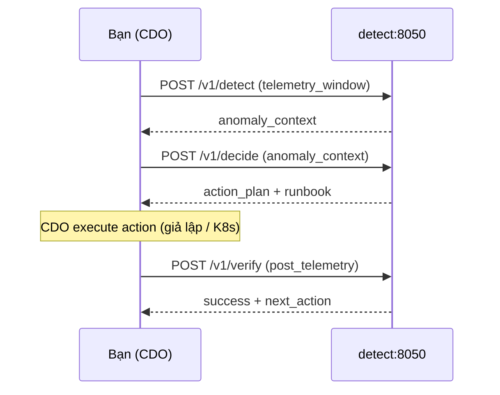

# Hướng dẫn test End-to-End — Detect → Decide → Verify (Unified)

Tài liệu này hướng dẫn **tự test** luồng AIOps AI Engine trên máy local (Windows / PowerShell).

> **Cập nhật:** Detect và Decide đã **gộp vào một server** (port **8050**). Logic decide dùng **full fault → runbook mapping** (giống `decide/`), không còn bản lite (chỉ cpu + default).

---

## 1. Kiến trúc luồng test

```text
Bạn (đóng vai CDO)
    │
    └─► detect :8050  (một server duy nhất)
            POST /v1/detect   → anomaly_context
            POST /v1/decide   → action_plan (runbook)
            POST /v1/verify   → xác nhận healing
```

| Endpoint | Port | Ghi chú |
|----------|------|---------|
| `POST /v1/detect` | **8050** | BOCPD + BARO RCA |
| `POST /v1/decide` | **8050** | Full rule-based decide (cpu/mem/delay/…) |
| `POST /v1/verify` | **8050** | Kiểm tra sau khi CDO execute |

Swagger: http://127.0.0.1:8050/docs

### Decide tools (trong `detect_decide/`)

Benchmark và catalog runbook nằm trong unified server folder:

- `detect_decide/scripts/benchmark_decide.py` — đo runbook accuracy offline
- `detect_decide/scripts/benchmark_e2e.py` — đo **chuỗi detect → decide** (90 runs)
- `detect_decide/src/runbook_catalog.py` — tạo lại `dataset/runbooks.json`

**E2E chỉ cần detect :8050** — CDO gọi cả 3 endpoint trên cùng base URL.

### Dataset dùng chung

```text
ai-engine/
  dataset/              ← RE2 data, ground_truth.json, runbooks.json
  detect_decide/        ← Unified server (detect + decide + verify)
```

---

## 2. Chuẩn bị

### 2.1. Mở 2 terminal

| Terminal | Mục đích |
|----------|----------|
| **T1** | Chạy detect server (8050) |
| **T2** | Gửi request / chạy script test |

### 2.2. Kích hoạt môi trường Python

```powershell
cd "c:\Users\AdminPC\Downloads\Project\Ourfile\Capstone-Phase-2-Code\tf-3\ai\ai-engine"
.\.venv\Scripts\Activate.ps1
pip install -r detect\requirements.txt
```

### 2.3. Kiểm tra dataset

```powershell
dir dataset
```

Cần có:
- `ground_truth.json`
- `runbooks.json`
- thư mục RE2 (ví dụ `checkoutservice_cpu\1\`)

Nếu thiếu `runbooks.json`:

```powershell
cd detect
python -c "from src.runbook_catalog import write_runbooks; write_runbooks()"
```

---

## 3. Khởi động server

### T1 — Unified detect server (port 8050)

```powershell
cd "c:\Users\AdminPC\Downloads\Project\Ourfile\Capstone-Phase-2-Code\tf-3\ai\ai-engine\detect"
python -m uvicorn src.server:app --host 127.0.0.1 --port 8050 --reload
```

Giữ terminal **mở**. Server load `runbooks.json` từ `dataset/` khi xử lý `/v1/decide`.

### Health check (T2)

```powershell
curl http://127.0.0.1:8050/docs
```

Mở Swagger — phải thấy **3 endpoint**: `/v1/detect`, `/v1/decide`, `/v1/verify`.

---

## 4. Bước 1 — POST /v1/detect

### Cách A — Swagger (khuyên dùng)

1. Mở: http://127.0.0.1:8050/docs
2. Chọn `POST /v1/detect` → **Try it out**
3. Dán payload mẫu:

```json
{
  "correlation_id": "11111111-1111-1111-1111-111111111111",
  "idempotency_key": "22222222-2222-2222-2222-222222222222",
  "dry_run_mode": false,
  "telemetry_window": [
    {
      "ts": "2024-01-15T18:44:06Z",
      "tenant_id": "d3b07384-d113-495f-9f58-20d18d357d75",
      "service": "checkoutservice",
      "signal_name": "cpu",
      "value": 0.25,
      "labels": {"namespace": "production"}
    },
    {
      "ts": "2024-01-15T18:44:16Z",
      "tenant_id": "d3b07384-d113-495f-9f58-20d18d357d75",
      "service": "checkoutservice",
      "signal_name": "cpu",
      "value": 4.5,
      "labels": {"namespace": "production"}
    },
    {
      "ts": "2024-01-15T18:44:16Z",
      "tenant_id": "d3b07384-d113-495f-9f58-20d18d357d75",
      "service": "checkoutservice",
      "signal_name": "application_log_event",
      "value": "checkoutservice: CPU saturation reached!",
      "labels": {"level": "error", "namespace": "production"}
    }
  ]
}
```

4. Bấm **Execute**

### Ghi lại từ response

| Trường | Ý nghĩa |
|--------|---------|
| `anomaly_detected` | Phải là `true` |
| `anomaly_context` | **Copy nguyên object** — dùng cho bước decide |
| `correlation_id` | Dùng lại ở decide và verify |

Nếu `anomaly_detected: false` → tăng spike metric hoặc thêm log lỗi rồi gọi lại.

> **Lưu ý:** `target_service` có thể là **list top-5** services từ BARO. Decide tự lấy service #1.

### Cách B — Script

```powershell
cd detect
python scripts\test_api.py
```

(Test cả detect → decide → verify trên **8050**.)

---

## 5. Bước 2 — POST /v1/decide (cùng port 8050)

1. Vẫn trên: http://127.0.0.1:8050/docs
2. Chọn `POST /v1/decide` → **Try it out**
3. Dùng **cùng** `correlation_id` / `idempotency_key`, dán `anomaly_context` từ detect:

```json
{
  "correlation_id": "11111111-1111-1111-1111-111111111111",
  "idempotency_key": "22222222-2222-2222-2222-222222222222",
  "dry_run_mode": false,
  "anomaly_context": {
    "target_service": "checkoutservice",
    "suspected_fault_type": "cpu",
    "system": "E-COMMERCE",
    "namespace": "production",
    "deployment": "deployment/checkoutservice",
    "trigger_metric": "cpu",
    "trigger_value": 4.5
  }
}
```

> Dùng `anomaly_context` **thật** từ response detect khi test E2E thật.

### Kết quả kỳ vọng (fault `cpu`)

| Trường | Giá trị |
|--------|---------|
| `matched_runbook` | `CPUSaturationRecoveryRunbook` |
| `action_plan[0].action` | `SCALE_REPLICAS` |
| `action_plan[0].target` | `deployment/checkoutservice` |

### Test fault `mem`

```json
"suspected_fault_type": "mem",
"target_service": "cartservice"
```

| Trường | Giá trị |
|--------|---------|
| `matched_runbook` | `MemoryLeakRecoveryRunbook` |
| `action_plan[0].action` | `PATCH_MEMORY_LIMIT` |

### Test fault RE3 (tùy chọn)

`suspected_fault_type: "f1"`, `target_service: "cartservice"`:

- Kỳ vọng: `DefaultRecoveryRunbook` + `RESTART_DEPLOYMENT`

---

## 6. Bước 3 — POST /v1/verify (port 8050)

1. `POST /v1/verify` trên http://127.0.0.1:8050/docs
2. Payload mẫu (giả lập CDO đã execute action):

```json
{
  "correlation_id": "11111111-1111-1111-1111-111111111111",
  "idempotency_key": "33333333-3333-3333-3333-333333333333",
  "dry_run_mode": false,
  "action_executed": {
    "action": "SCALE_REPLICAS",
    "target": "deployment/checkoutservice",
    "status": "COMPLETED",
    "execution_time_seconds": 45
  },
  "post_telemetry_window": [
    {
      "ts": "2024-01-15T18:50:00Z",
      "tenant_id": "d3b07384-d113-495f-9f58-20d18d357d75",
      "service": "checkoutservice",
      "signal_name": "checkoutservice_error",
      "value": 0.0,
      "labels": {"namespace": "production"}
    },
    {
      "ts": "2024-01-15T18:50:00Z",
      "tenant_id": "d3b07384-d113-495f-9f58-20d18d357d75",
      "service": "checkoutservice",
      "signal_name": "checkoutservice_latency-50",
      "value": 0.02,
      "labels": {"namespace": "production"}
    }
  ]
}
```

### Kết quả kỳ vọng

| Trường | Giá trị |
|--------|---------|
| `success` | `true` |
| `next_action` | `DONE` |
| `regression_detected` | `false` |

---

## 7. Checklist end-to-end

```
[ ] T1: detect server chạy 8050 (detect + decide + verify)
[ ] Swagger có đủ 3 endpoint
[ ] POST /v1/detect → anomaly_detected = true
[ ] Copy anomaly_context từ detect
[ ] POST /v1/decide (8050) → đúng runbook + action_plan
[ ] POST /v1/verify (8050) → success = true, next_action = DONE
```

---

## 8. Benchmark (không cần server E2E)

> Tất cả lệnh chạy từ folder `detect_decide/`.

### 8.1. E2E — Detect → Decide (khuyên dùng, 1 script)

Đo **cả chuỗi**: anomaly detection + BARO RCA → `SelfHealer` chọn runbook.

```powershell
cd detect_decide
python scripts\benchmark_e2e.py --sample-size 90 --engine baro --top-k 3
```

Output: `detect_decide/benchmark_report_e2e.json`

| Metric | Ý nghĩa |
|--------|---------|
| `detect.service_top1_accuracy` | RCA đúng service |
| `detect.macro_precision` / `macro_f1` | Precision / F1 (Jira) |
| `decide.runbook_accuracy_e2e` | Runbook đúng **sau detect** (dùng fault từ RCA) |
| `decide.runbook_accuracy_oracle_fault` | Runbook nếu fault đúng (upper bound) |
| `decide.pipeline_success_rate` | Detect + đúng service + đúng runbook |

Thêm `-v` để in từng run.

### 8.2. Detect RCA riêng — Top-1 / Top-3

```powershell
cd detect_decide
python scripts\evaluate.py --sample-size 90 --engine baro --use-bocpd --top-k 3
```

### 8.3. Decide runbook accuracy riêng (oracle fault)

```powershell
cd detect_decide
python scripts\benchmark_decide.py
```

Output: `detect_decide/benchmark_report_re2.json` — fault từ ground truth (không qua detect).

### 8.4. Setup ground truth (nếu chưa có)

```powershell
cd detect_decide
python scripts\generate_ground_truth.py
```

---

## 9. Fault → Runbook mapping (detect & decide dùng chung)

| `suspected_fault_type` | Runbook | Action chính |
|------------------------|---------|--------------|
| `cpu` | CPUSaturationRecoveryRunbook | SCALE_REPLICAS |
| `mem` | MemoryLeakRecoveryRunbook | PATCH_MEMORY_LIMIT |
| `delay` | NetworkLatencyRecoveryRunbook | RESTART_DEPLOYMENT |
| `loss` | PacketLossRecoveryRunbook | RESTART_DEPLOYMENT |
| `disk` | DiskIORecoveryRunbook | RESTART_DEPLOYMENT |
| `socket` | SocketExhaustionRecoveryRunbook | SCALE_REPLICAS |
| `f1`–`f5` (RE3) | DefaultRecoveryRunbook | RESTART_DEPLOYMENT |
| khác | DefaultRecoveryRunbook | RESTART_DEPLOYMENT |

Mapping nằm trong `detect/src/config.py` (`FAULT_RUNBOOK_MAPPING`).

---

## 10. Sơ đồ sequence (unified)



---

## 11. CDO simulator (tự động)

### Full loop 1 run RE2 (data thật)

Server **8050** phải đang chạy:

```powershell
cd detect
python cdo_simulator\simulate_self_healing.py checkoutservice_cpu_1
```

### 6 contract scenarios (mock telemetry)

```powershell
python cdo_simulator\simulate_all_scenarios.py
```

> Trên Windows: sửa `server_cmd` trong file thành `[sys.executable, "-m", "src.server"]` nếu path Linux bị lỗi.

Output JSON mẫu: `detect/cdo_simulator/test_jsons/`

---

## 12. Xử lý lỗi thường gặp

| Triệu chứng | Nguyên nhân | Cách xử lý |
|-------------|-------------|------------|
| `Connection refused` 8050 | Server chưa chạy | Start uvicorn trong `detect/` |
| `WinError 10048` | Port bị chiếm | `netstat -ano \| findstr :8050` → `taskkill /PID <PID> /F` |
| Decide trả Default cho `mem` | Lite logic cũ / thiếu mapping | Pull branch mới — phải trả `MemoryLeakRecoveryRunbook` |
| `runbooks.json not found` | Dataset chưa setup | `write_runbooks()` hoặc `generate_dataset_metadata.py` |
| Verify `success: false` | post_telemetry error/latency cao | Giảm `value` error/latency trong payload |
| Gọi decide trên 8051 | Kiến trúc cũ (tách service) | E2E mới: **tất cả trên 8050** |

---

## 13. Tài liệu liên quan

- Contract API: `tf-3/ai/contracts/ai-api-contract.md`
- Detect README: `tf-3/ai/ai-engine/detect/README.md`
- Scripts guide: `tf-3/ai/ai-engine/detect/SCRIPTS-AND-SIMULATOR-GUIDE.md`
