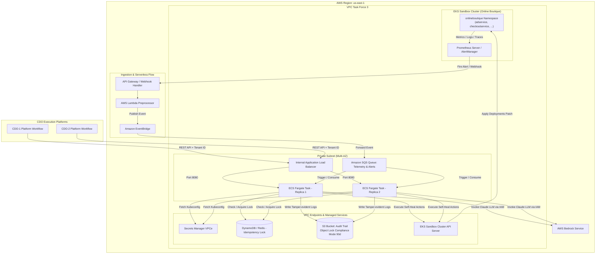

# Deployment Contract - Task Force 3 (Self-Heal Engine)

## 1. Mục đích

Tài liệu này xác định **quy chuẩn triển khai hạ tầng (Deployment Specification)** của AI Engine và các phân quyền Kubernetes đi kèm để thực thi các hành động khắc phục lỗi. Các phân quyền và hạ tầng được thiết kế tương thích với các ứng dụng microservice có trong **RE2 và RE3 dataset**.

---

## 2. Infrastructure Hosting & Offline Testing Strategy

AI Engine được triển khai dưới dạng **ECS Fargate tasks** độc lập, phục vụ multi-tenant cho cả 2 CDO platform.

| Aspect | Configuration |
|---|---|
| **Target Compute** | ECS Fargate |
| **Cluster name** | `tf-3-aiops-cluster` |
| **Service name** | `ai-selfheal-engine` |
| **Capacity per task** | 1.0 vCPU, 2.0 GB Memory |
| **Scaling Policy** | Min: 2 tasks, Max: 10 tasks |
| **Networking** | Private subnets, internal ALB (SG-to-SG reference) |

### Chiến lược chạy thử nghiệm mô phỏng (Offline Simulation Mode)
* Vì RE2 và RE3 dataset là dữ liệu offline đã thu thập dưới dạng CSV tĩnh, các hành động sửa đổi hạ tầng thật (`RESTART_DEPLOYMENT`, `SCALE_UP_PODS`,...) sẽ được **chạy ở chế độ giả lập (Mock Mode)** trong môi trường sandbox của CDO.
* CDO Platform sẽ ghi nhận lệnh gọi từ AI Engine, ghi log kiểm toán tương ứng, và mô phỏng phản hồi thành công. Dữ liệu telemetry phản hồi tiếp theo sẽ được trích xuất từ dữ liệu tĩnh lịch sử (sau mốc thời gian lỗi của dataset) để gửi verify.

---

## 2.1 Deployment Topology Diagram

Dưới đây là sơ đồ chi tiết kiến trúc hạ tầng và luồng dữ liệu của hệ thống tự chữa lành (Self-Heal Engine) được triển khai trên EKS Sandbox Cluster cho hệ thống **Online Boutique**:



---

## 3. Kubernetes RBAC & Safety Constraints (Least Privilege)
1. AI Engine vẫn được host trên ECS Fargate và chỉ dùng quyền này để gọi EKS API thực thi self-heal 
2. Để thực thi các kịch bản tự chữa lành (Self-Heal Actions) trên EKS Sandbox Cluster chạy các dịch vụ RE2 và RE3 (Online Boutique) mà vẫn bảo đảm chính sách an toàn (**Zero unsafe actions**):

- **Không** cấp quyền quản trị cụm (`ClusterAdmin`).
- **Không** cấp quyền chỉnh sửa cấu hình phân quyền K8s (`ClusterRole`, `RoleBinding`).
- **Không** cấp quyền sửa đổi tài khoản IAM hoặc AWS credentials.
- Chỉ cho phép thao tác trong namespace thực tế tương ứng với hệ thống Online Boutique: `onlineboutique`.

### Định nghĩa K8s Role (RBAC YAML Specification)

Nhóm CDO chịu trách nhiệm apply `Role` và `RoleBinding` trên sandbox cluster cho namespace `onlineboutique`:

```yaml
apiVersion: rbac.authorization.k8s.io/v1
kind: Role
metadata:
  namespace: onlineboutique
  name: self-heal-executor-role
rules:
  # 1. Quyền restart deployment (patch template.metadata.annotations)
  # 2. Quyền scale deployment (patch spec.replicas)
  - apiGroups: ["apps"]
    resources: ["deployments", "deployments/scale"]
    verbs: ["get", "list", "patch", "update"]

  # 3. Quyền restart/delete pods trực tiếp hoặc get log để đính kèm context bundle
  - apiGroups: [""]
    resources: ["pods", "pods/log"]
    verbs: ["get", "list", "delete"]

  # 4. Quyền rotate secrets hoặc update configmaps (rotate TLS cert, update env secret)
  - apiGroups: [""]
    resources: ["secrets", "configmaps"]
    verbs: ["get", "list", "patch", "update"]
---
apiVersion: rbac.authorization.k8s.io/v1
kind: RoleBinding
metadata:
  namespace: onlineboutique
  name: self-heal-executor-binding
subjects:
  - kind: ServiceAccount
    name: self-heal-engine-sa
    namespace: onlineboutique
roleRef:
  kind: Role
  name: self-heal-executor-role
  apiGroup: rbac.authorization.k8s.io
```

---

## 4. Idempotency Lock & Audit Logging (SOC2 Compliance)

### A. Idempotency Lock
- Mọi action plan được quyết định tại `/v1/decide` phải có `Idempotency-Key`.
- Nhóm CDO platform sử dụng **DynamoDB với Conditional Writes** (hoặc **Redis lock** với TTL = 5 phút) để khóa trùng lặp lệnh. Nếu một action đang chạy, mọi request trùng `Idempotency-Key` sẽ bị từ chối với mã lỗi `409 Conflict`.

### B. Tamper-Evident Audit Logging
- Mọi chu kỳ xử lý (Detect -> Decide -> Execute -> Verify) bắt buộc phải được ghi nhật ký hoạt động đầy đủ.
- **Hạ tầng lưu trữ**: Sử dụng **Amazon S3** được cấu hình chế độ **Object Lock** (WORM - Write Once, Read Many) ở chế độ **Compliance mode** với thời gian giữ tối thiểu **90 ngày**.
- CDO platform chịu trách nhiệm cung cấp giao diện truy vấn nhật ký kiểm toán (thông qua Amazon Athena hoặc UI quản trị).

---

## 5. Rollback & Canary Rollout

### Rollout Strategy (Canary)
- **Bước 1**: Điều hướng 10% lưu lượng sang phiên bản AI Engine mới. Giữ trong 5 phút.
- **Bước 2**: Tăng lên 50% lưu lượng. Giữ trong 5 phút.
- **Bước 3**: Hoàn tất 100% lưu lượng.

### Tiêu chuẩn dừng khẩn cấp (Abort Criteria & Auto-Rollback)
Hệ thống giám sát Canary của CDO sẽ tự động dừng rollout và kích hoạt rollback về phiên bản trước đó trong vòng **60 giây** nếu phát hiện:
- Tỷ lệ lỗi API của AI Engine (`5xx` error rate) vượt quá `1.0%`.
- Độ trễ phản hồi p99 của AI Engine vượt quá `800 ms`.
- **Cơ chế rollback**: ArgoCD tự động rollback trạng thái Kubernetes sang Git commit SHA trước đó.
