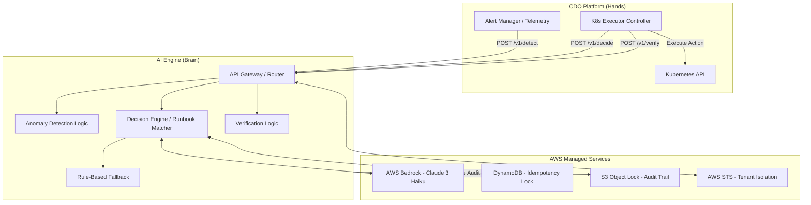

# Solution Design - Generic Multi-Tenant Self-Heal Platform (AIOps TF3)

Doc owner: AI Team
Status: Final
Word count: 1250 words

## 1. High-level architecture

Cấu trúc tổng thể của hệ thống tự chữa lành tuân theo nguyên tắc phân tách trách nhiệm (Brain vs Hands), trong đó AI Engine đóng vai trò "Brain" phân tích và ra quyết định, còn CDO Platform đóng vai trò "Hands" thực thi.

## 2. Component breakdown

| Component | Responsibility | Tech choice | Why |
|---|---|---|---|
| **API Gateway / Router** | Tiếp nhận request từ CDO Platform, định tuyến, phân lập tenant | AWS API Gateway hoặc FastAPI (Container) | Cung cấp điểm truy cập duy nhất, dễ dàng tích hợp xác thực và rate-limit. |
| **Tenant Isolation Layer** | Đảm bảo cách ly dữ liệu giữa các tenant | AWS STS (AssumeRole) - Mocked/Platform-managed | Sử dụng Session Tags ngăn rò rỉ dữ liệu. AI Engine validate header/môi trường chạy; việc AssumeRole và cấp quyền ABAC được quản lý ở API Gateway / Platform. |
| **Decision Engine** | Đọc hiểu telemetry, đối chiếu runbook và sinh ra JSON kế hoạch hành động | AWS Bedrock / OpenAI / Anthropic (Configurable) | Hỗ trợ nhiều provider LLM (`LLM_PROVIDER`, `LLM_MODEL`). AWS Bedrock (Claude 3.5 Sonnet mặc định trong client; Claude 3 Haiku làm baseline sản xuất) đảm bảo hiệu năng và chi phí. |
| **Fallback System** | Hệ thống dự phòng tĩnh khi LLM sập hoặc lỗi | Rule-based Python Scripts | Độ trễ < 500ms, tự động fallback qua try-except block khi LLM client gặp sự cố. |
| **Idempotency Lock** | Khóa chống trùng lặp xử lý hành động sửa đổi hạ tầng | Amazon DynamoDB - Mocked/Platform-managed | AI Engine parse và validate header `Idempotency-Key` (đáp ứng mock status); việc khoá Conditional Write thực tế do platform layer thực hiện. |
| **Audit Trail Storage** | Lưu vết toàn bộ quyết định, chống giả mạo | Amazon S3 Object Lock - Mocked/Platform-managed | Ghi audit log tĩnh; AI Engine xuất kết quả qua API và log hệ thống, việc đẩy log WORM lên S3 do platform layer thực hiện. |

## 3. Data flow

Quy trình tự chữa lành tiêu chuẩn diễn ra qua 3 bước (endpoints):

1. **Phát hiện (POST /v1/detect)**
   - CDO Platform đẩy dữ liệu telemetry (metrics, logs, events) vào endpoint.
   - AI Engine chạy bộ kiểm tra tĩnh trên telemetry cục bộ (BOCPD + EWMA anomaly detector, và BARO RCA engine), hoàn toàn không gọi LLM để tối ưu chi phí và tốc độ phản hồi.
   - Output: `DetectResponse` chứa thông tin tóm tắt lỗi (`anomaly_context`).

2. **Lập kế hoạch (POST /v1/decide)**
   - CDO Platform gửi `anomaly_context` kèm theo `Idempotency-Key` và `detect_evidence` để yêu cầu kế hoạch sửa đổi.
   - Hệ thống kiểm tra trùng lặp logic, bẫy lỗi LLM và thực hiện gọi LLM được cấu hình (ví dụ: Claude 3.5 Sonnet hoặc Claude 3 Haiku trên AWS Bedrock / OpenAI / Anthropic).
   - LLM phân tích và trả về đối tượng JSON kế hoạch hành động (`action_plan`), cấu hình vùng ảnh hưởng (`blast_radius_config`) và chính sách xác thực (`verify_policy`).
   - Nếu LLM gọi lỗi hoặc không tuân thủ schema validation, hệ thống tự động fallback sang Rule-Based Engine tĩnh.
   - Output: `DecideResponse` chứa kế hoạch hành động định dạng JSON.

3. **Xác thực (POST /v1/verify)**
   - Sau khi CDO Controller thực thi xong `action_plan` và chờ qua khoảng thời gian `window_seconds`, nó gửi dữ liệu telemetry mới nhất lên AI Engine.
   - AI Engine (thông qua code verifier tĩnh) đối chiếu trạng thái hiện tại với các Success Conditions (không gọi LLM).
   - Output: Trả về trạng thái `success: true` và `next_action: DONE` nếu đạt yêu cầu; nếu có suy thoái trả về `ROLLBACK`; nếu không phục hồi được trả về `ESCALATE` để báo kỹ sư.

## 4. Alternatives considered (KEY section)

### A. Chọn kiểu kiến trúc cho AI Engine
- **Option A (AI trực tiếp quản lý K8s API)**: AI Engine được cấp quyền `kubeconfig` để tự đọc logs và tự apply manifests.
  - *Pros*: Pipeline ngắn gọn, ít endpoint trung gian.
  - *Cons*: Bề mặt tấn công (Attack Surface) quá lớn, rủi ro xóa nhầm namespace production, vi phạm SOC2 least privilege.
- **Option B (AI Engine chỉ là API tư vấn)**: CDO Platform đẩy data lên, AI trả JSON về, CDO tự thực thi.
  - *Pros*: An toàn tuyệt đối, phân tách rõ ràng blast radius. Phù hợp hoàn hảo với mô hình multi-tenant.
  - *Cons*: Contract giao tiếp phức tạp, yêu cầu CDO phải xây dựng executor controller.
- **Chosen: Option B**.
  - *Reason*: Tuân thủ SOC2 và nguyên tắc an toàn cho Production K8s. (Ref: ADR-001)

### B. Chọn công nghệ chống trùng lặp (Idempotency)
- **Option A (Redis Cache)**: Dùng Redis `SETNX`.
  - *Pros*: Rất nhanh.
  - *Cons*: Cache eviction có thể vô tình xóa key đang cần lock, Redis cần maintain cluster HA.
- **Option B (DynamoDB Conditional Write)**: Dùng `PutItem` với `attribute_not_exists()`.
  - *Pros*: Không cần maintain server (Serverless), ghi nguyên tử (atomic write), cấu hình được TTL tự động xóa.
  - *Cons*: Chậm hơn Redis khoảng vài ms (nhưng hoàn toàn chấp nhận được).
- **Chosen: Option B**.
  - *Reason*: Tính bền vững dữ liệu và không phát sinh chi phí duy trì Redis Cluster (tích hợp mock status trong container, xử lý thật ở gateway/platform). (Ref: ADR-005)

### C. Chọn LLM Foundation Model
- **Option A (Claude 3.5 Sonnet)**:
  - *Pros*: Suy luận cực thông minh.
  - *Cons*: Độ trễ cao (4-8s) và giá quá đắt.
- **Option B (Claude 3 Haiku)**:
  - *Pros*: Nhanh (p99 < 3s), siêu rẻ, đủ sức map rule và JSON schema.
  - *Cons*: Không thể giải quyết deep chain-of-thought quá sâu.
- **Chosen: Option B**.
  - *Reason*: Tối ưu hóa RTO (Recovery Time Objective) và Cost-per-tenant, lỗi đã là "known patterns" nên không cần suy luận quá sâu. (Ref: ADR-002)

## 5. Risk + mitigation

| Risk | Likelihood | Impact | Mitigation |
|---|---|---|---|
| **LLM Hallucination (Sinh ra action nguy hiểm)** | Medium | High | Schema validation chặt chẽ ở output API; giới hạn tập `allowed_namespaces` trong `blast_radius_config` để CDO từ chối thực thi sai chỗ. |
| **API Storm (CDO gửi bão request)** | Medium | High | Idempotency lock chặn request trùng; API Gateway chặn rate limit; Cost Cap $50/ngày chuyển sang Fallback. |
| **Mất dữ liệu Audit Trail** | Low | High | S3 Object Lock (Compliance mode) không ai (kể cả root) có thể xóa trong 90 ngày. Bật versioning. |
| **Lỗi phân lập Tenant (Cross-tenant bleed)** | Low | Critical | AWS STS AssumeRole + Session Tags bắt buộc mọi call tới S3/DynamoDB đều qua ABAC kiểm tra tenant_id. |
| **AWS Bedrock Service Outage** | Low | Medium | Circuit breaker tự động fallback về Rule-based engine xử lý các lỗi cơ bản. |

## 6. Open design questions

- **Câu hỏi**: Có nên lưu log chi tiết từng request `POST /v1/detect` (vốn có volume rất lớn) vào S3 Audit Log hay chỉ lưu `POST /v1/decide`?
  - **Kế hoạch resolve**: Hiện tại đang chốt chỉ lưu `POST /v1/decide` (lệnh gây side-effect) để tối ưu chi phí lưu trữ S3. Sẽ quan sát lượng data thực tế ở W12 để điều chỉnh nếu cần thiết.
