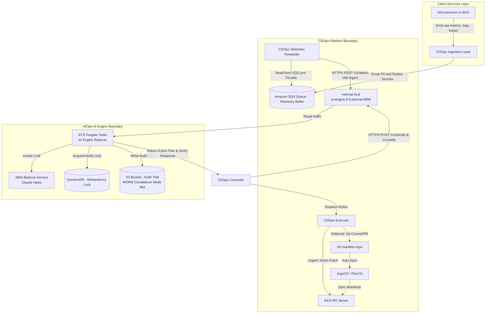

# Solution Design - Generic Multi-Tenant Self-Heal Platform (AIOps TF3)

Doc owner: AI Team
Status: Final
Word count: 1450 words

## 1. High-level architecture

Kiến trúc hệ thống tự chữa lành AIOps TF3 tuân thủ nguyên tắc phân tách rõ ràng giữa bộ não đưa ra quyết định (AI Engine) và bàn tay thực thi hành động hạ tầng (CDOps Platform). Mô hình này đảm bảo tính an toàn, bảo mật và khả năng mở rộng đa thuê bao.

*Diagram caption: Sơ đồ kiến trúc toàn trình của hệ thống tự chữa lành AIOps TF3. Dữ liệu giám sát được thu thập, lọc sạch thông tin nhạy cảm và đệm qua SQS trước khi gửi sang AI Engine. AI Engine phân tích dữ liệu, ghi nhận nhật ký kiểm toán bất biến trên S3, kiểm tra trùng lặp trên DynamoDB và đưa ra kế hoạch hành động để CDOps Platform thực thi độc lập trên EKS.*

## 2. Component breakdown

Hệ thống được chia thành bốn thành phần chính với vai trò và công nghệ lựa chọn cụ thể:

| Component | Responsibility | Tech choice | Why |
|---|---|---|---|
| Ingestion & Buffer | Thu thập dữ liệu giám sát (metrics, logs, traces) từ microservices, chạy bộ lọc xóa thông tin nhạy cảm (PII scrubbing), lưu trữ tạm thời và điều phối lưu lượng. | Prometheus, Fluentd, OpenTelemetry Collector, Amazon SQS | Đảm bảo thu thập đầy đủ tín hiệu, thực hiện tiền xử lý dữ liệu trước khi gửi đi và kiểm soát tốc độ truyền tải (Backpressure) để tránh quá tải cho AI Engine. |
| AI Engine | Tiếp nhận các yêu cầu phát hiện bất thường (/v1/detect), lập kế hoạch khắc phục (/v1/decide), và xác thực kết quả chữa lành (/v1/verify). | Python, FastAPI, AWS ECS Fargate, AWS Bedrock (Claude Haiku) | ECS Fargate cung cấp môi trường chạy container serverless ổn định, tự động co giãn. Bedrock Claude Haiku tối ưu hóa giữa hiệu năng suy luận logic, độ trễ phản hồi thấp và chi phí vận hành hợp lý. |
| Audit & Lock | Lưu trữ nhật ký kiểm toán hoạt động bất biến phục vụ tuân thủ SOC2 và duy trì khóa chống trùng lặp xử lý sự cố. | Amazon S3 (Object Lock Compliance Mode), Amazon DynamoDB (Conditional Writes) | S3 Object Lock đảm bảo tính bất biến của log trong 90 ngày. DynamoDB hỗ trợ ghi có điều kiện để thực hiện cơ chế khóa phân tán với độ trễ dưới 10ms. |
| CDOps Executor | Tiếp nhận kế hoạch hành động từ AI Engine, kiểm tra vùng ảnh hưởng (Blast Radius) và thực thi các hành động chữa lành lên hạ tầng. | CDOps Controller, Kubernetes API, Git (GitOps), ArgoCD | Tách biệt hoàn toàn quyền sửa đổi hạ tầng khỏi AI Engine. Hỗ trợ cả luồng vá trực tiếp (urgent) và đồng bộ manifest (deferred/GitOps) để giữ tính nhất quán hệ thống. |

## 3. Data flow (step-by-step)

Chu trình tự chữa lành khép kín (Self-Healing Loop) diễn ra theo các bước sau:

1. **Bước 1: Phát sinh và Thu thập Telemetry**: Các microservices trong cụm EKS phát sinh dữ liệu giám sát. Lớp Ingestion của CDOps thu thập, thực hiện regex để loại bỏ thông tin nhạy cảm (như email, mật khẩu, connection string trong stack trace) và ghi vào Amazon SQS.
2. **Bước 2: Phát hiện Bất thường**: Tiến trình Forwarder đọc dữ liệu từ SQS và gửi (batch-push) sang API `/v1/detect` của AI Engine. AI Engine phân tích dòng dữ liệu và phản hồi trạng thái có lỗi hay không, kèm theo mức độ nghiêm trọng và dịch vụ nghi ngờ.
3. **Bước 3: Yêu cầu Lập Kế hoạch**: Nếu phát hiện bất thường, CDOps Controller lập tức gửi yêu cầu lập kế hoạch tới API `/v1/decide`, truyền kèm `correlation_id`, `Idempotency-Key` và ngữ cảnh lỗi.
4. **Bước 4: Sinh Quyết định Chữa lành**: AI Engine kiểm tra hạn mức chi phí của Tenant trên DynamoDB. Nếu chi phí dưới $50/ngày, hệ thống gọi Bedrock Claude Haiku để ánh xạ lỗi với thư viện Runbook và sinh ra `action_plan`. Nếu vượt hạn mức hoặc Bedrock gặp sự cố, hệ thống tự động chuyển sang chế độ Rule-Based. Đồng thời, AI Engine ghi khóa idempotency lên DynamoDB và ghi log kiểm toán lên S3 Object Lock trước khi phản hồi cho CDOps.
5. **Bước 5: Thực thi Hành động**: CDOps Controller tiếp nhận phản hồi, xác thực vùng ảnh hưởng. Dựa vào `pattern_type`, CDOps Executor sẽ thực hiện:
   * Nếu là "urgent": Thực hiện patch trực tiếp tài nguyên qua Kubernetes API Server.
   * Nếu là "deferred": Tạo Git commit/PR cập nhật manifest trên Git repository để ArgoCD tự động đồng bộ xuống EKS.
6. **Bước 6: Xác thực Kết quả**: CDOps Controller đợi một khoảng thời gian `window_seconds` (quy định trong chính sách xác thực), thu thập dữ liệu telemetry sau sự kiện và gửi tới API `/v1/verify`.
7. **Bước 7: Kết thúc Chu trình hoặc Leo thang**: AI Engine phân tích telemetry sau sự kiện để xác định lỗi đã được khắc phục hoàn toàn hay chưa. Nếu thành công, hệ thống giải phóng khóa idempotency và kết thúc chu trình với trạng thái "DONE". Nếu thất bại, hệ thống đưa ra chỉ dẫn "RETRY", "ROLLBACK", hoặc "ESCALATE" (kèm theo `escalation_bundle` chứa log và metrics cho kỹ sư trực ban).

## 4. Alternatives considered

### 4.1 AI Pattern: Single-shot LLM vs Multi-agent

* **Option A - Multi-agent**: Sử dụng một nhóm các tác nhân AI chuyên biệt (một tác nhân đọc log, một tác nhân phân tích trace, một tác nhân đưa ra quyết định) trao đổi liên tục để giải quyết sự cố.
  * Pros: Phân tích sâu sắc, có khả năng xử lý các ca lỗi cực kỳ phức tạp và tự sửa đổi kế hoạch linh hoạt.
  * Cons: Độ trễ phản hồi cực lớn (thường từ 15 đến 60 giây cho nhiều lượt gọi LLM), chi phí token rất cao, khó kiểm soát hành vi bất định của agent.
* **Option B - Single-shot LLM**: Sử dụng một lượt gọi LLM duy nhất với cấu trúc Prompt rõ ràng, kết hợp ngữ cảnh telemetry được chuẩn hóa để sinh ra cấu hình JSON Schema định sẵn.
  * Pros: Độ trễ thấp (dưới 3 giây), chi phí token tối ưu, kết quả trả về tuân thủ nghiêm ngặt định dạng schema để lập trình hệ thống dễ dàng.
  * Cons: Bị hạn chế khả năng suy luận đa bước tự động đối với các lỗi hệ thống có tính chất bắc cầu phức tạp.
* **Chosen**: Option B (Single-shot LLM) - Lý do: Trong hệ thống tự chữa lành, thời gian phục hồi (RTO) là yếu tố sống còn. Độ trễ dưới 3 giây của Single-shot LLM giúp hệ thống đưa ra phản ứng tức thì, đồng thời việc ép cấu trúc JSON Schema đầu ra đảm bảo CDOps Platform có thể phân tích cú pháp và thực thi an toàn mà không sợ lỗi định dạng văn bản tự do.

### 4.2 Remediation Execution: AI Engine trực tiếp thực thi vs CDOps Platform thực thi

* **Option A - AI Engine trực tiếp thực thi**: AI Engine được cấp quyền Kubernetes RBAC và cấu hình mạng để gọi thẳng vào EKS API Server nhằm thực hiện các lệnh restart, patch, scale tài nguyên sau khi đưa ra quyết định.
  * Pros: Luồng xử lý trực tiếp, giảm độ trễ và trung gian truyền tin giữa hai hệ thống.
  * Cons: Vi phạm nghiêm trọng nguyên tắc an toàn thông tin và đặc quyền tối thiểu. Nếu container AI Engine bị tấn công hoặc LLM bị prompt injection, kẻ tấn công sẽ có toàn quyền can thiệp vào cụm Kubernetes. Rất khó thực hiện kiểm toán độc lập.
* **Option B - CDOps Platform thực thi**: AI Engine chỉ đóng vai trò phân tích và trả về kế hoạch hành động dưới dạng cấu trúc dữ liệu. CDOps Platform tiếp nhận cấu trúc này, chạy qua bộ lọc kiểm tra an toàn (Blast Radius) nội bộ của mình và tự thực hiện cuộc gọi vào EKS.
  * Pros: Đảm bảo phân tách rõ ràng trách nhiệm (Brain vs Hands). AI Engine chỉ cần quyền đọc dữ liệu giám sát và không có bất kỳ quyền sửa đổi hạ tầng nào. CDOps Platform đóng vai trò chốt chặn an toàn cuối cùng.
  * Cons: Tăng thêm một bước trung gian và yêu cầu định nghĩa giao thức API chặt chẽ giữa hai bên.
* **Chosen**: Option B (CDOps Platform thực thi) - Lý do: Đây là lựa chọn bắt buộc để đáp ứng tiêu chuẩn SOC2 và đảm bảo an toàn cho cụm máy chủ sản xuất. Quyền sửa đổi hạ tầng phải được giữ tập trung tại nền tảng CDO Platform dưới sự kiểm soát nghiêm ngặt của các chính sách an toàn mạng và RBAC nội bộ.

## 5. Risk + mitigation

| Risk | Likelihood | Impact | Mitigation |
|---|---|---|---|
| AI Engine đưa ra quyết định sai do ảo tưởng (hallucination) hoặc prompt injection. | Medium | High | Thiết lập ngưỡng tin cậy (confidence >= 0.6) mới cho phép tự động thực thi. Đầu ra bắt buộc phải được xác thực nghiêm ngặt bằng JSON Schema. CDOps Platform kiểm tra giới hạn Blast Radius (tỷ lệ pod bị ảnh hưởng tối đa) trước khi chạy. |
| Dịch vụ AWS Bedrock bị giới hạn tần suất gọi (HTTP 429) hoặc gặp sự cố (HTTP 5xx / Timeout). | Medium | Medium | Thiết lập cơ chế ngắt mạch (Circuit Breaker) trong mã nguồn. Khi tỷ lệ lỗi Bedrock vượt quá 60%, hệ thống tự động chuyển sang chế độ dự phòng Rule-Based (chạy cây quyết định tĩnh nội bộ) với thời gian phản hồi dưới 500ms. |
| Rò rỉ dữ liệu chéo giữa các Tenants (Multi-tenant data leakage). | Low | High | Sử dụng mã định danh `tenant_id` trong header API. Thực hiện AWS STS AssumeRole động dựa trên Tenant ID để lấy quyền truy cập tài nguyên bị phân lập logic bằng Session Tags. Không lưu trữ ngữ cảnh phiên làm việc giữa các request. |
| Vòng lặp lỗi vô hạn gây bùng nổ chi phí gọi LLM Bedrock (Runaway cost). | Medium | High | Thiết lập hạn mức chi phí cứng cho Bedrock là $50/ngày trên mỗi Tenant. Khi đạt 80% ($40) hệ thống gửi cảnh báo khẩn cấp. Khi đạt 100% ($50), hệ thống tự động ngắt Bedrock và chuyển hẳn sang chế độ Rule-Based cho đến hết ngày (reset vào 00:00:00 UTC). |

## 6. Open design questions

* Q1: Làm thế nào để đồng bộ hóa trạng thái giữa Git và cụm Kubernetes khi thực hiện luồng GitOps (deferred) để tránh xung đột với các thay đổi thủ công?
  * Resolved: CDOps Platform quy định luồng deferred bắt buộc phải đi qua Git commit/PR. ArgoCD được cấu hình ở chế độ tự động đồng bộ (Auto-Sync) kèm theo cơ chế tự động loại bỏ các tài nguyên không được định nghĩa trong Git (Prune), đảm bảo Git luôn là nguồn sự thật duy nhất (Single Source of Truth). Mọi thay đổi trực tiếp lên cụm bằng lệnh patch sẽ bị ArgoCD ghi đè lại sau chu kỳ quét.

## Related documents

* [01_requirements.md](01_requirements.md) - Yêu cầu nghiệp vụ và chỉ số đo lường thành công của dự án
* [03_ai_engine_spec.md](03_ai_engine_spec.md) - Đặc tả kỹ thuật chi tiết của AI Engine và cơ chế quản trị
* [05_adrs.md](05_adrs.md) - Nhật ký ghi nhận các quyết định kiến trúc quan trọng của hệ thống
* [ai-api-contract.md](../contracts/ai-api-contract.md) - Hợp đồng giao diện API giữa AI Engine và CDO Platform
* [deployment-contract.md](../contracts/deployment-contract.md) - Hợp đồng quy định cấu hình triển khai và hạ tầng
* [telemetry-contract.md](../contracts/telemetry-contract.md) - Hợp đồng định nghĩa cấu trúc dữ liệu giám sát
